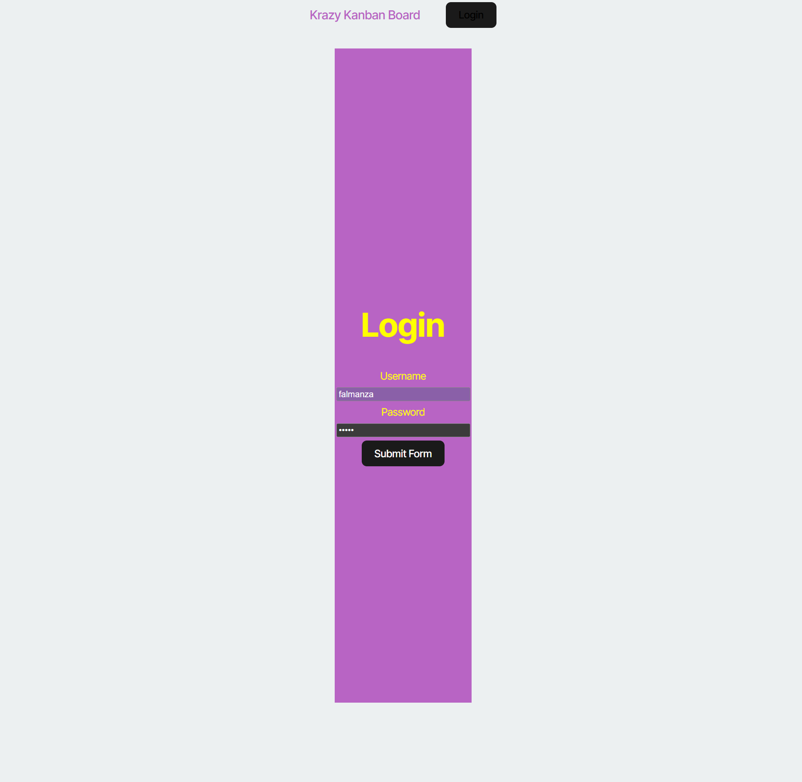

# Kanban Board

## Description
The Kanban board application has already been created. It's your job to complete the UI for the login page, add authentication with JWT to the server API, and then deploy the entire application to Render.




## Table of Contents
* [Installation](#installation)
* [Collaborators](#collaborators)
* [Link](#link-to-website)
* [Questions](#questions)


## Installation
1. Clone the repository:
```bash
    git clone https://github.com/Falmanza94/React-Portfolio-Ku-Coding-Bootcamp-2025.git
```

3. Run the Program:
```bash
    npm run start:dev
```


## Collaborators
 I used the Xpert Learning Assistant Chat+, Chapt GPT, and MDN_Web_Docs as my resources.


## Link to Website
https://kanban-board-ku-coding-bootcamp-2025.onrender.com

## Questions
If you have questions, reach out to me at [fischer.almanza@gmail.com](mailto:fischer.almanza@gmail.com). You can find more of my work at [Falmanza94](https://github.com/Falmanza94).
